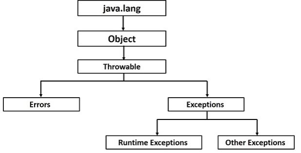

### OOP -- Encapsulation, inheritance, polymorphism, and abstraction.

## Exception 
- Exception
- Checked exceptions - FileReader 
- Unchecked exceptions OR Runtime Exceptions ->  ArrayIndexOutOfBoundsException
- Errors 
 
- Throws : If a method does not handle a checked exception, the method must declare it using the throws keyword.
- throw  
```
   public void test throws RemoteException {
      throw new RemoteException();
   }
```
- Finally

## Inheritance
- extends 
- IS-A Relationship
```
  public class Animal {
  }

  public class Mammal extends Animal {
  }
  Mammal IS-A Animal
```
- HAS-A relationship
```
public class Vehicle{}
public class Speed{}
public class Van extends Vehicle {
   private Speed sp;
} 
```
- implements 
- Overriding

### Overriding
- The argument list should be exactly the same as that of the overridden method.
- The return type should be the same or a subtype of the return type declared in the original overridden method in the superclass.
- The access level cannot be more restrictive than the overridden method's access level. For example: If the superclass method is   
  declared public then the overridding method in the sub class cannot be either private or protected.
- Instance methods can be overridden only if they are inherited by the subclass.
- A method declared final cannot be overridden.
- A method declared static cannot be overridden but can be re-declared.
- If a method cannot be inherited, then it cannot be overridden.
- A subclass within the same package as the instance's superclass can override any superclass method that is not declared private or 
  final.
- A subclass in a different package can only override the non-final methods declared public or protected.
- An overriding method can throw any uncheck exceptions, regardless of whether the overridden method throws exceptions or not. However, the overriding method should not throw checked exceptions that are new or broader than the ones declared by the overridden method. The overriding method can throw narrower or fewer exceptions than the overridden method.
- Constructors cannot be overridden.

### Abstract Class
```
public abstract class Employee {
   public abstract double computePay();
}
public class Salary extends Employee {
   public double computePay() {
    return 10.0
   }
}
```

### Generics
- Methods
```
public static < E > void printArray( E[] inputArray ) {
   for(E element : inputArray) {
      System.out.printf("%s ", element);
   }
   System.out.println();
}

Integer[] intArray = { 1, 2, 3, 4, 5 };
printArray(intArray);
```

